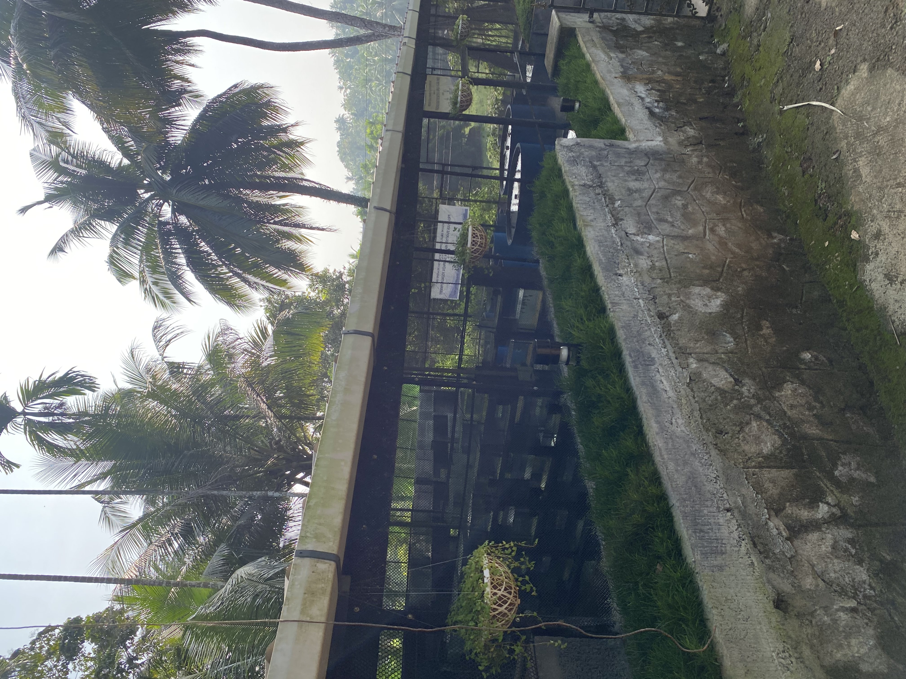
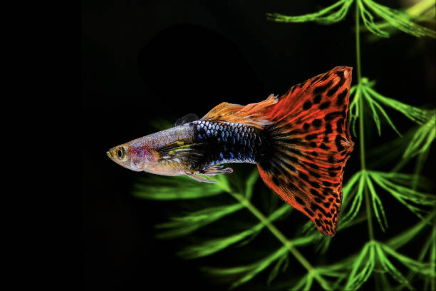
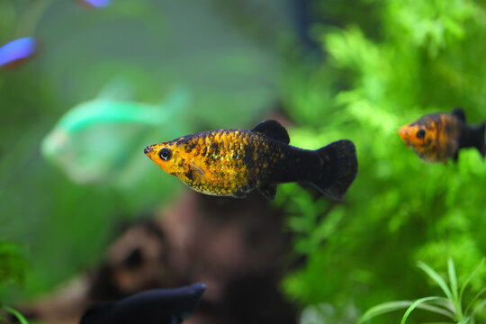
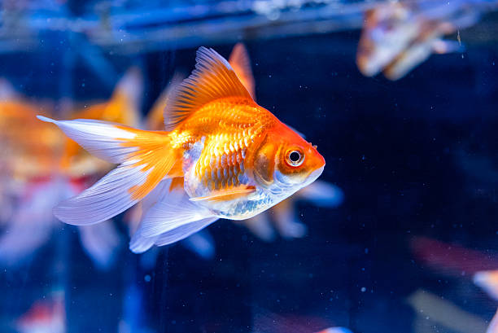
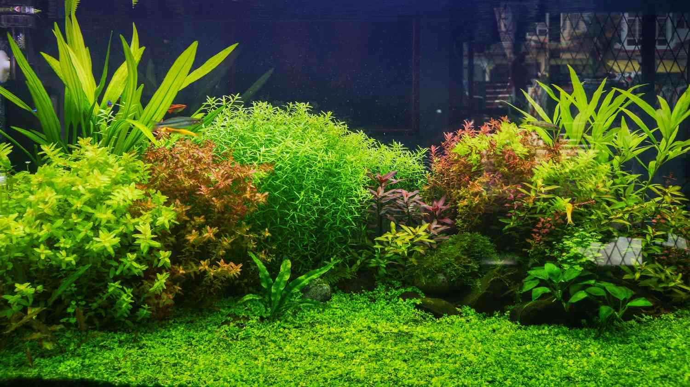
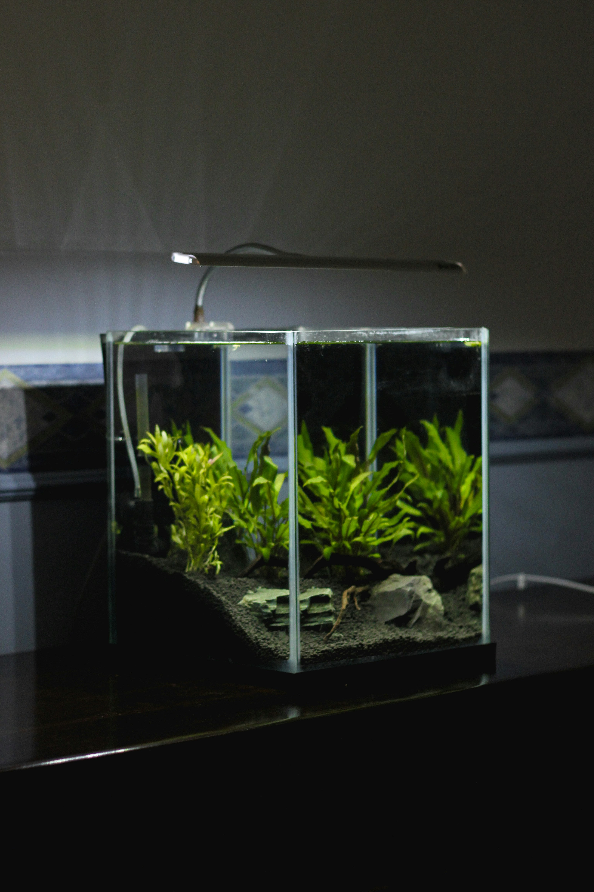
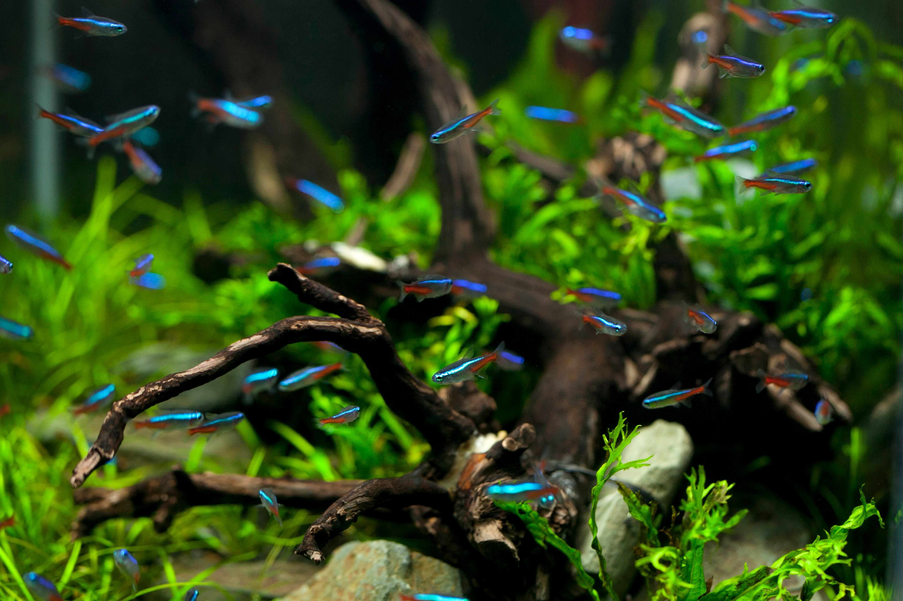
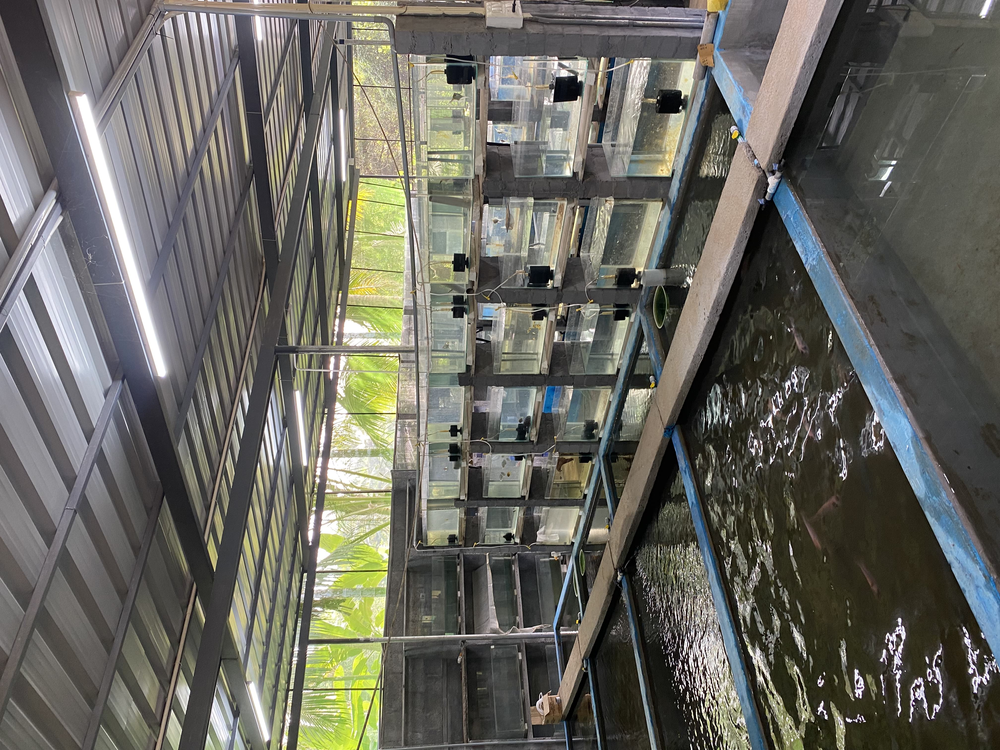

<!DOCTYPE html>
<html lang="en">
<head>
  <meta charset="UTF-8">
  <meta name="viewport" content="width=device-width, initial-scale=1.0">

  <title>Dwaraka Fish Farm | Ornamental Fish & Aquariums</title>

  <meta name="description"
        content="Dwaraka Fish Farm - Ornamental fish, aquarium plants, aquariums and accessories in Kozhikode, Kerala.">

  
</head>

<body>

<!-- NAVIGATION -->

<header>
  <nav>

    

      🐟 DWARAKA FISH FARM
    

    <ul class="nav-links">
      <li><a href="#home">Home</a></li>
      <li><a href="#about">About</a></li>
      <li><a href="#products">Fish</a></li>
      <li><a href="#services">Services</a></li>
      <li><a href="#gallery">Gallery</a></li>
      <li><a href="#contact">Contact</a></li>
    </ul>

  </nav>
</header>

<!-- HERO -->

<section class="hero" id="home">

  

    <h1>
      Dwaraka Fish Farm
    </h1>

    

      Ornamental Fish • Aquariums • Aquarium Plants
    

    

      Bringing the beauty of underwater life to your home.
    

    <a href="#products" class="button">
      Explore Our Fish
    </a>

    <a href="#contact" class="button button-outline">
      Contact Us
    </a>

  

</section>

<!-- ABOUT -->

<section id="about">

  

    

      

      

        <h2>About Our Farm</h2>

        

          Welcome to Dwaraka Fish Farm, your destination for
          beautiful ornamental fish, aquarium plants and
          aquarium solutions.
        

        

          We provide healthy and carefully maintained fish
          for hobbyists, beginners and aquarium enthusiasts.
        

        

          From individual fish to complete aquarium setups,
          we aim to make aquarium keeping simple and enjoyable.
        

      

    

  

</section>

<!-- PRODUCTS -->

<section id="products">

  

    

      <h2>Our Collection</h2>

      

        Explore some of the varieties available at our farm.
      

    

    

      

        

        

          <h3>Guppies</h3>

          

            Colourful and active ornamental fish.
          

        

      

      

        

        

          <h3>Betta</h3>

          

            Beautiful freshwater fish with stunning colours.
          

        

      

      

        

        

          <h3>Molly</h3>

          

            Hardy and beginner-friendly ornamental fish.
          

        

      

      

        

        

          <h3>Goldfish</h3>

          

            Classic aquarium favourite.
          

        

      

      

        

        

          <h3>Aquarium Plants</h3>

          

            Natural plants for beautiful aquascapes.
          

        

      

      

        

        

          <h3>Custom Aquariums</h3>

          

            Aquariums designed according to your requirements.
          

        

      

    

  

</section>

<!-- SERVICES -->

<section id="services">

  

    

      <h2>What We Offer</h2>

      

        Everything you need to create your own underwater world.
      

    

    

      

        
🐟

        <h3>Ornamental Fish</h3>

        

          Different varieties and colour strains.
        

      

      

        
🌿

        <h3>Aquarium Plants</h3>

        

          Plants for natural and planted aquariums.
        

      

      

        
🪟

        <h3>Custom Aquariums</h3>

        

          Aquarium construction and setup.
        

      

      

        
🚚

        <h3>Delivery</h3>

        

          Contact us for available delivery options.
        

      

    

  

</section>

<!-- GALLERY -->

<section id="gallery">

  

    

      <h2>Our Gallery</h2>

      

        A glimpse into Dwaraka Fish Farm.
      

    

    

      
      
      
      
      
      

    

  

</section>

<!-- CONTACT -->

<section id="contact">

  

    

      <h2>Visit Dwaraka Fish Farm</h2>

      

        Have a question about fish, plants or aquariums?
      

      

        Contact us directly.
      

      <!-- CHANGE THIS NUMBER -->

      <a
        href="https://wa.me/919387522912"
        class="button"
        target="_blank">

        WhatsApp Us

      </a>

      <!-- CHANGE PHONE NUMBER -->

      <a
        href="tel:+919387522912"
        class="button button-outline">

        Call Us

      </a>

      

        📍 Kozhikode, Kerala, India
      

    

  

</section>

<!-- FOOTER -->

<footer>

  

    © 2026 <strong>Dwaraka Fish Farm</strong>
  

  

    Ornamental Fish • Aquariums • Aquarium Plants
  

</footer>

</body>
</html>
